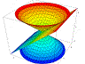

<h1 align="center">
  
</h1>

  
  
  
  
  
  
  

 

  Hi, I'm Mikhail Fedosov, Java Backend Developer ☕️
   
   
  🔬 I'm currently studying for Infromation Security at HSE, Moscow Institute of Elecrtronics and Math
   
  💻 I love writing code and learn anythings about it
   
  📫 How to reach me: <a href="mailto: fedosovmichael@gmail.com">fedosovmichael@gmail.com</a>

<h2 align="center">🛠 My fancy badge area</h2>
 

<h2 align="center">⚡ Stats ⚡</h2>
 

  

    
  

           
  

    
  

   

  

<!--
Notes: If you want use this readme, firstly star it please.
-->
